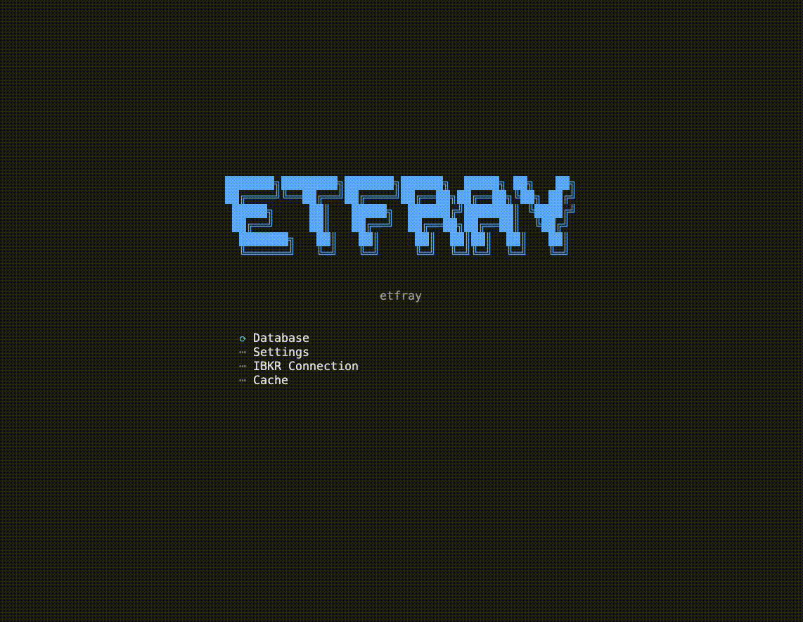

# etfray

[](https://github.com/alwank/etfray/actions/workflows/ci.yml)
[](https://etfray.readthedocs.io)
[](https://pypi.org/project/etfray/)
[](https://opensource.org/licenses/MIT)

<p align="center">
  
</p>

A terminal-based ETF research and portfolio analytics application built with [Textual](https://textual.textualize.io/).

etfray converts SEC fund filings and IBKR portfolio data into holdings, exposure, concentration, margin, and risk workflows — all from your terminal.

## Features

- **ETF Research** — Search ETFs, view holdings, sector exposure, concentration, fees, risk metrics, and SEC documents via EDGAR
- **Portfolio Analytics** — Connect to IBKR TWS/Gateway for live positions, lookthrough exposure, concentration analysis, and margin/leverage monitoring
- **Keyboard-first** — Full TUI with command palette, tree navigation, and keybindings
- **Local & private** — All data cached locally in SQLite; no cloud accounts required

## Installation

```bash
pip install etfray
```

Requires Python 3.11+.

## Quick Start

```bash
etfray
```

Use the sidebar tree to navigate between Research and Portfolio workspaces. Press `ctrl+p` to open the command palette.

### IBKR Connection

To use portfolio analytics, you need [IBKR TWS](https://www.interactivebrokers.com/en/trading/tws.php) or [IB Gateway](https://www.interactivebrokers.com/en/trading/ibgateway-stable.php) running with API connections enabled (default port 7497).

Configure the connection in Settings (`ctrl+,`).

## Documentation

Full documentation at [etfray.readthedocs.io](https://etfray.readthedocs.io):

- [Installation](https://etfray.readthedocs.io/getting-started/installation/)
- [User Guide](https://etfray.readthedocs.io/user-guide/etf-research/)
- [IBKR Setup](https://etfray.readthedocs.io/user-guide/ibkr-setup/)
- [Developer Guide](https://etfray.readthedocs.io/developer/architecture/)

## Development

```bash
git clone https://github.com/alwank/etfray.git
cd etfray
python -m venv .venv
source .venv/bin/activate
pip install -e ".[dev,docs]"
pytest
```

## License

[MIT](LICENSE)
