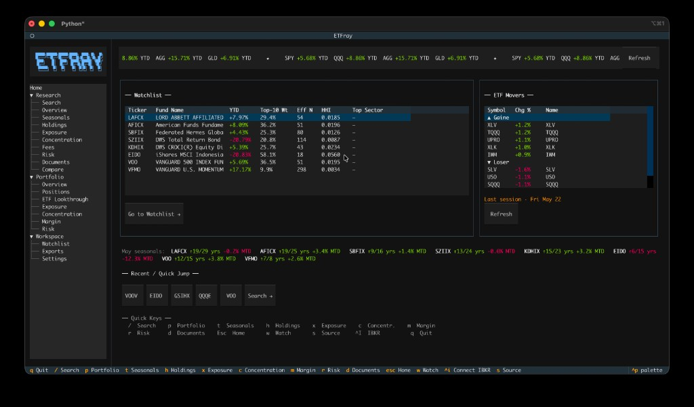
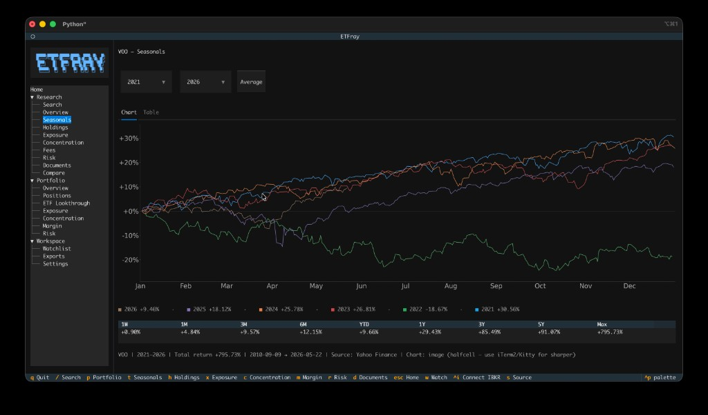
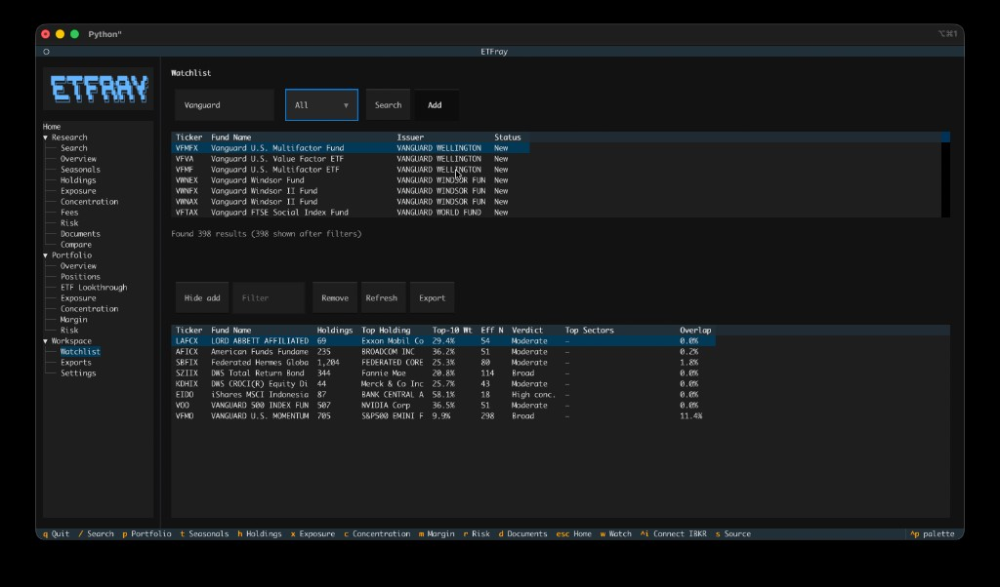
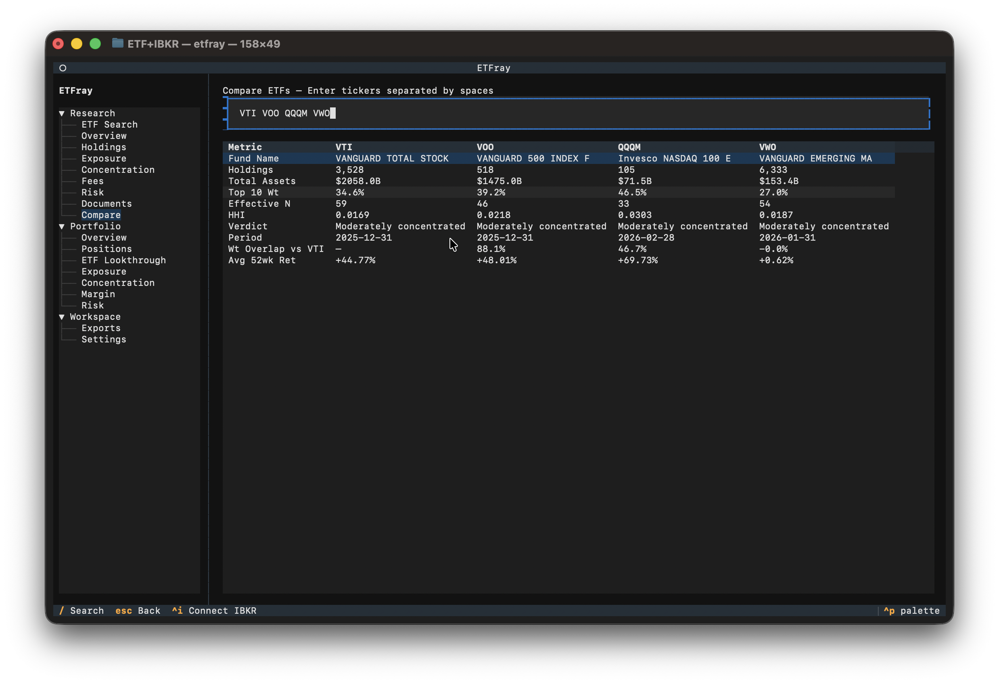
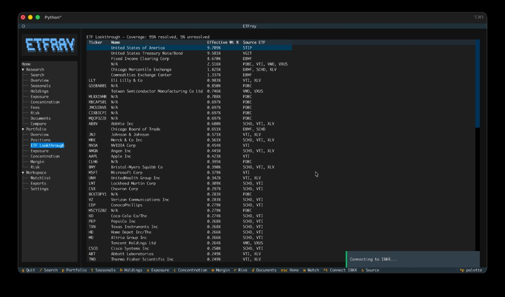
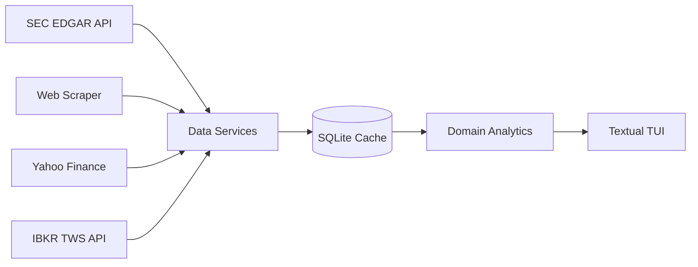

# etfray

[](https://github.com/alwank/etfray/actions/workflows/ci.yml)
[](https://etfray.readthedocs.io/en/latest/)
[](https://pypi.org/project/etfray/)
[](https://opensource.org/licenses/MIT)

<p align="center">
  
</p>

A terminal-based ETF research and portfolio analytics application built with [Textual](https://textual.textualize.io/).

etfray converts SEC fund filings and IBKR portfolio data into holdings, exposure, concentration, margin, and risk workflows — all from your terminal.

## Why etfray?

- **No cloud accounts** — No sign-ups, no API keys to manage, no third-party dashboards. Your data stays on your machine.
- **No subscriptions** — ETF holdings data comes directly from SEC EDGAR filings. Free, authoritative, and always available.
- **Keyboard-first** — Designed for speed. Command palette, tree navigation, and keybindings — no mouse required.

## Features

- **Home Dashboard** — Live startup screen with benchmark marquee (SPY/QQQ/AGG/GLD YTD), watchlist snapshot, ETF daily movers (top-5 gainers/losers), seasonal spotlight for the current month, and recent quick-jump pills
- **ETF Research** — Search ETFs, view holdings, sector/geographic exposure, concentration, fees, risk metrics, and SEC documents via EDGAR
- **Seasonals** — TradingView-style seasonals chart with year-over-year cumulative returns, period returns table (1W to Max), and year range selection
- **Fund Overview** — Rich fund profile combining SEC filings with Yahoo Finance metadata (category, expense ratio, dividend yield, beta, returns, description)
- **Watchlist** — Track ETFs with at-a-glance metrics: concentration, top sectors, overlap vs portfolio, and data freshness
- **Portfolio Analytics** — Connect to IBKR TWS/Gateway for live positions, lookthrough exposure, concentration analysis, margin/leverage monitoring, and stress scenarios
- **Side-by-side Compare** — Compare multiple ETFs across holdings, exposure, overlap, fees, and 52-week returns in a single view
- **Export** — Save any view to CSV or JSON for further analysis
- **Keyboard-first** — Full TUI with command palette, tree navigation, and keybindings
- **Local & private** — All data cached locally in SQLite; no cloud accounts required

<table>
  <tr>
    <td align="center"><br><sub><b>Home Dashboard</b></sub></td>
    <td align="center"><br><sub><b>Seasonals Chart</b></sub></td>
  </tr>
  <tr>
    <td align="center"><br><sub><b>ETF Holdings</b></sub></td>
    <td align="center"><br><sub><b>Watchlist</b></sub></td>
  </tr>
  <tr>
    <td align="center"><br><sub><b>Side-by-side Compare</b></sub></td>
    <td align="center"><br><sub><b>Portfolio ETF Lookthrough</b></sub></td>
  </tr>
</table>

## Key Capabilities

| Capability | Details |
|---|---|
| ETF coverage | Thousands of ETFs via SEC EDGAR N-PORT filings |
| Data sources | EDGAR (official), alternative web scraper, Yahoo Finance (metadata, price history & screener), IBKR TWS |
| Home Dashboard | Live benchmark marquee, ETF movers (gainers/losers), watchlist snapshot, seasonal spotlight, recent quick-jump |
| Holdings analysis | Full position-level breakdown with weight, value, shares |
| Fund metadata | Category, expense ratio, dividend yield, beta, inception date, returns via yfinance |
| Seasonals | Year-over-year cumulative return chart with matplotlib or plotext rendering; seasonal spotlight on home screen |
| Exposure | Sector and geographic exposure from underlying holdings |
| Concentration | Top-N analysis (top 10, 25, 50) with cumulative weight; Jaccard pairwise overlap scoring at portfolio level |
| Compare | Side-by-side comparison of 2–5 ETFs with weight-adjusted overlap and 52-week return columns |
| Watchlist | Track ETFs with concentration metrics, sector breakdown, and portfolio overlap |
| Portfolio | Real-time positions, lookthrough exposure, margin & leverage, stress scenarios (−10%/−20%) |
| Storage | Local SQLite — no cloud, no external databases |
| Freshness | Configurable staleness thresholds (default: 30 days fresh, 90 days acceptable) |

## Usage Examples

### Home Dashboard

The Home screen loads automatically at startup with four live panels:

1. **Benchmark Marquee** — Scrolling YTD return bar for SPY, QQQ, AGG, GLD. Click **Refresh** to force a fresh fetch.
2. **Watchlist Snapshot** — Compact table of your tracked ETFs with YTD, Top-10 Weight, Effective N, HHI, and Top Sector. Double-click any row to open that ETF.
3. **ETF Movers** — Top-5 daily gainers and losers. A yellow "Last session" label appears when market data is stale (outside trading hours). Double-click to open an ETF. Click **Refresh** for the latest data.
4. **Seasonal Spotlight** — Current-month win rate and MTD return for each watchlist ticker (e.g., `SPY ↑9/15 yrs +1.2% MTD`).

Recent ETFs appear as quick-jump pill buttons below the panels.

### Research an ETF

1. Launch `etfray` and navigate to **Research → Search** in the sidebar
2. Press `/` to open ETF Search, type a ticker (e.g., `VTI`), and press Enter
3. Browse tabs: **Overview** → **Seasonals** → **Holdings** → **Exposure** → **Concentration** → **Risk**
4. Press `w` to add the ETF to your watchlist

### View seasonals

1. Search for an ETF (e.g., `SPY`)
2. Press `t` to jump to the Seasonals view
3. Select year range to compare seasonal patterns across years
4. Review the period returns table for standard return intervals

### Manage your watchlist

1. Navigate to **Workspace → Watchlist** in the sidebar
2. Click **Add ticker** to search and add ETFs
3. View concentration, sector, and overlap metrics at a glance
4. Double-click any row to open that ETF's research view

### Monitor your portfolio

1. Ensure IBKR TWS/Gateway is running with API enabled on port 7497
2. Navigate to **Portfolio → Positions** in the sidebar
3. etfray connects lazily — positions load automatically on first access
4. Switch to **Lookthrough** to see aggregated exposure across all your ETF holdings
5. Check **Margin** for leverage ratio and margin cushion warnings

## Architecture



Design principles:

- **Local-first** — All data cached in SQLite. Works offline after initial fetch.
- **Source provenance** — Every data point tracks its origin and fetch date so you know how fresh it is.
- **Lazy connection** — IBKR connects only when portfolio views are accessed, not at startup.
- **Separation of concerns** — `data/` handles I/O, `domain/` handles computation, `ui/` handles presentation.

## Configuration

All settings are managed via **Workspace → Settings** in the sidebar and stored in `~/.etfray/data.db`.

| Setting | Default | Description |
|---|---|---|
| `ibkr_host` | `127.0.0.1` | IBKR TWS/Gateway host address |
| `ibkr_port` | `7497` | IBKR TWS/Gateway API port |
| `ibkr_client_id` | `1` | Client ID for the IBKR API connection |
| `edgar_identity` | *(empty)* | Your email — required by SEC fair use policy |
| `data_source` | `auto` | Holdings source: `auto`, `edgar`, or `web` |
| `freshness_days_fresh` | `30` | Days before cached data is no longer considered fresh |
| `freshness_days_acceptable` | `90` | Days before cached data is considered stale and re-fetched |
| `margin_warning_cushion` | `0.15` | Margin cushion threshold for warnings |
| `leverage_warning` | `2.0` | Leverage ratio warning threshold |
| `cache_dir` | `~/.etfray/cache` | Directory for SEC series/class lookup cache files |
| `export_dir` | `~/.etfray/exports` | Directory where CSV/JSON exports are saved |

See the [full configuration reference](https://etfray.readthedocs.io/en/latest/user-guide/configuration/) for all options.

## Installation

```bash
pip install etfray
```

Requires Python 3.11+.

**Seasonals chart (optional):** For a matplotlib seasonals chart in the Seasonals tab:

```bash
pip install etfray[charts]
# or from source:
pip install -e ".[charts]"
```

Verify dependencies: `python scripts/check_charts.py` (should report `Chart: image (matplotlib)` and `True`).

**Terminal image support** is required for a crisp chart (not blocky ASCII). Enable one of:

- **Cursor / VS Code:** Settings → `terminal.integrated.enableImages` → `true`, then restart the terminal
- **iTerm2, Kitty, WezTerm, or Windows Terminal 1.22+** (recommended)

Without `[charts]` or without image support, etfray uses an ASCII plotext chart and shows the active mode in the Seasonals summary line.

**Blurry chart?** If the summary says `Chart: image (halfcell)` or `(unicode)`, the terminal is using a low-resolution block renderer. For a sharp chart, run etfray in **iTerm2** or **Kitty**, or enable Cursor `terminal.integrated.enableImages` and restart the terminal. Check `python scripts/check_charts.py` for `protocol: sixel` or `tgp`.

## Quick Start

```bash
etfray
```

Use the sidebar tree to navigate between Research and Portfolio workspaces. Press `ctrl+p` to open the command palette.

### IBKR Connection

To use portfolio analytics, you need [IBKR TWS](https://www.interactivebrokers.com/en/trading/tws.php) or [IB Gateway](https://www.interactivebrokers.com/en/trading/ibgateway-stable.php) running with API connections enabled (default port 7497).

Configure the connection in **Workspace → Settings** in the sidebar.

## Documentation

Full documentation at [etfray.readthedocs.io](https://etfray.readthedocs.io/en/latest/):

- [Installation](https://etfray.readthedocs.io/en/latest/getting-started/installation/)
- [User Guide](https://etfray.readthedocs.io/en/latest/user-guide/etf-research/)
- [Seasonals](https://etfray.readthedocs.io/en/latest/user-guide/seasonals/)
- [Watchlist](https://etfray.readthedocs.io/en/latest/user-guide/watchlist/)
- [IBKR Setup](https://etfray.readthedocs.io/en/latest/user-guide/ibkr-setup/)
- [Developer Guide](https://etfray.readthedocs.io/en/latest/developer/architecture/)

## Development

```bash
git clone https://github.com/alwank/etfray.git
cd etfray
python -m venv .venv
source .venv/bin/activate
pip install -e ".[dev,docs]"
pytest
```

## License

[MIT](LICENSE)
