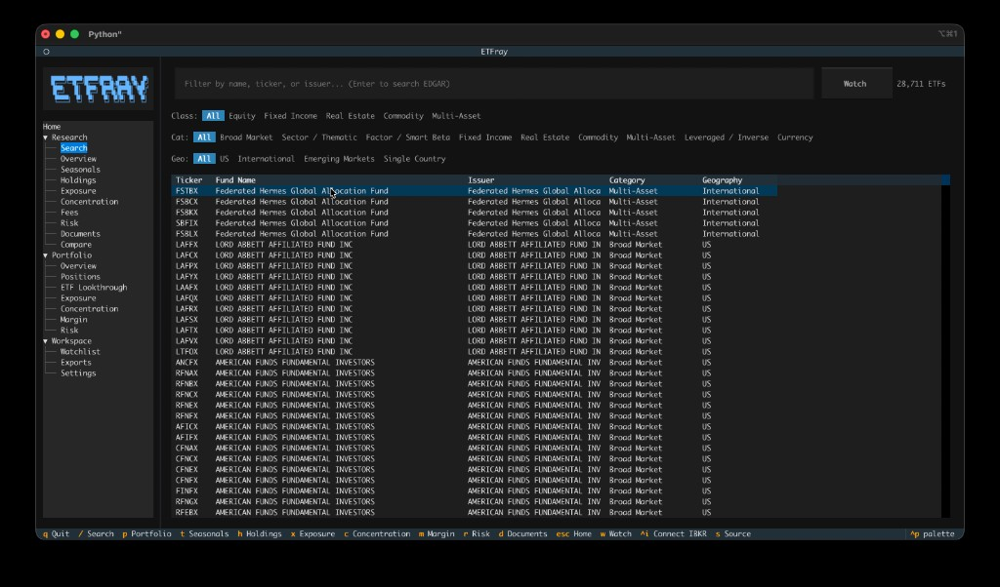

# Quick Start

## Launch

```bash
etfray
```

The app opens with a splash screen that runs startup checks (database, settings, IBKR connection, cache warmup) and dismisses automatically when complete. If TWS/Gateway is running, IBKR connects during splash; otherwise use `Ctrl+I` to connect later.

## Navigation

- **Sidebar tree** — Use the left panel to navigate between Research, Portfolio, and Workspace sections
- **Command palette** — Press `ctrl+p` to search and run any command
- **Settings** — Navigate to **Workspace → Settings** in the sidebar to configure IBKR connection and data sources

## First steps

1. Navigate to **Research → Search** in the sidebar (or press `/`)
2. Type an ETF ticker (e.g., `VTI`) and press Enter
3. Browse the **Overview** for fund profile and key metrics
4. Press `t` to view **Seasonals** — year-over-year return chart and period returns
5. Use `h`, `x`, `c` to jump between Holdings, Exposure, and Concentration
6. Press `w` to add the ETF to your **Watchlist**

{ width="700" }

## Watchlist

Navigate to **Workspace → Watchlist** to see all tracked ETFs with concentration metrics, top sectors, and portfolio overlap at a glance. Double-click any row to open that ETF's research view.

## Portfolio analytics

To use portfolio features, you need IBKR TWS or IB Gateway running. See [IBKR Setup](../user-guide/ibkr-setup.md) for details.

## Key shortcuts

| Key | Action |
|-----|--------|
| `/` | Search ETFs |
| `t` | Seasonals |
| `w` | Add to watchlist |
| `h` | Holdings |
| `x` | Exposure |
| `c` | Concentration |
| `p` | Portfolio |
| `ctrl+p` | Command palette |
| `q` | Quit |

See [Keybindings](../user-guide/keybindings.md) for the full list.
