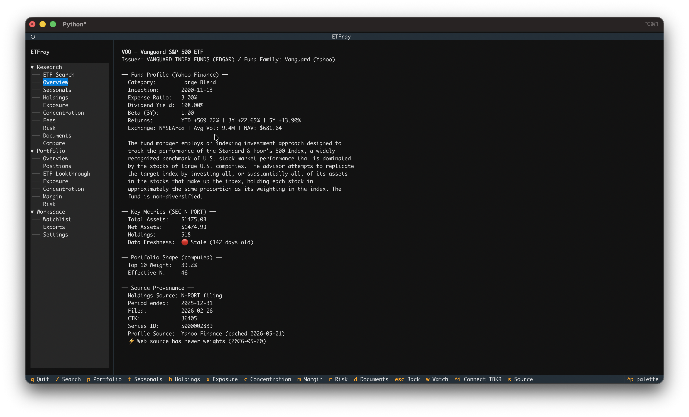
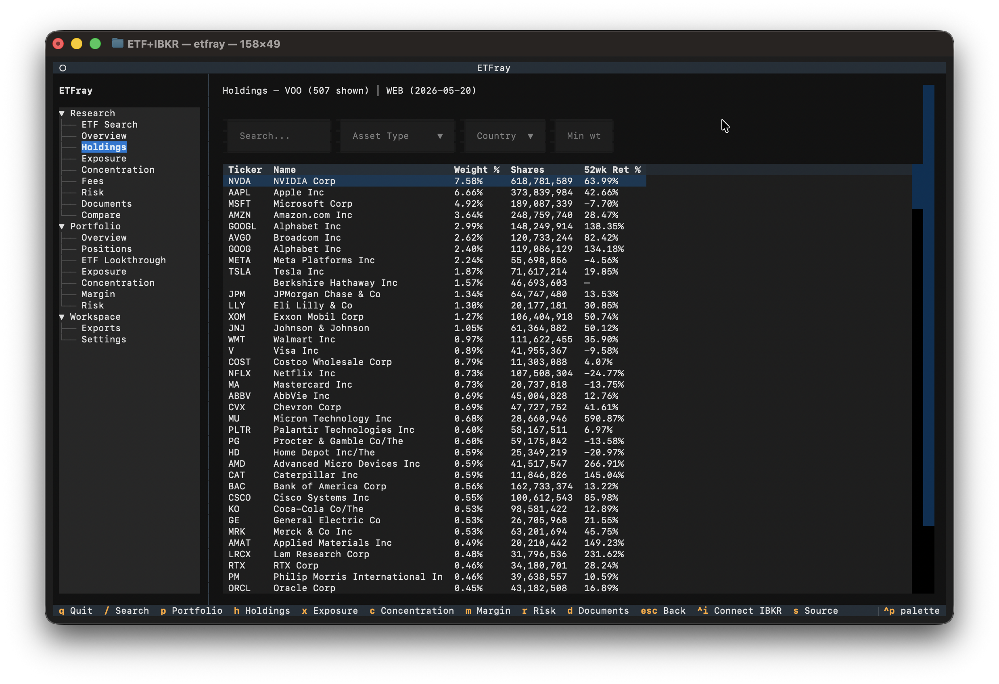
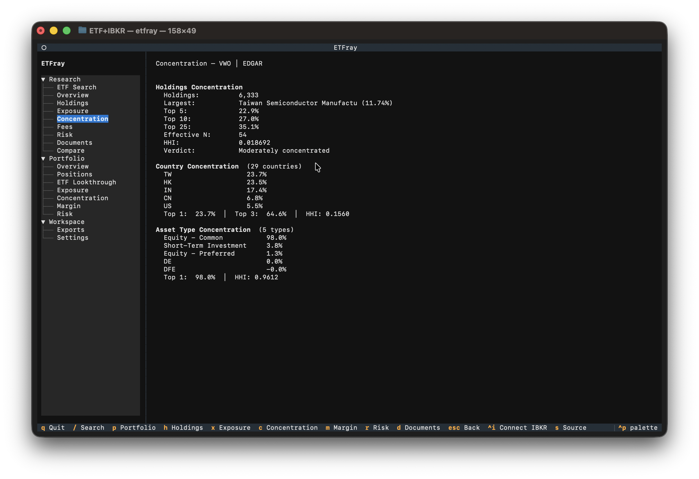

# ETF Research

The Research workspace lets you look up any ETF and explore its holdings, exposures, and risk characteristics using data from SEC EDGAR filings.

## Search

Navigate to **Research → Search** or press `/`. Enter a ticker symbol (e.g., `VTI`, `QQQM`, `AVUV`) to look up an ETF.

!!! tip
    Press `/` to jump straight to ETF Search — it's the fastest way to look up a fund. After searching, press `w` to add the ETF to your [Watchlist](watchlist.md).

## Views

### Overview

A rich fund profile combining data from two sources:

**Yahoo Finance profile** (fetched via yfinance, cached 7 days):

- Category (e.g., "Large Blend", "Technology")
- Inception date
- Expense ratio
- Dividend yield
- Beta (3-year)
- Returns: YTD, 3Y, 5Y
- Exchange, average volume, NAV
- Fund description

**SEC N-PORT filing** (via EDGAR):

- Total assets and net assets
- Number of holdings
- Reporting period and filing date
- Data freshness indicator (🟢 Fresh / 🟡 Acceptable / 🔴 Stale)

The Overview also shows computed **Portfolio Shape** metrics (top-10 weight, effective N, largest sector) and **Source Provenance** so you know exactly where each data point comes from and when it was fetched.

!!! tip
    If Yahoo Finance data is unavailable (rate-limited or ticker not found), the Overview still shows all EDGAR-sourced data. Reopen the ETF or wait a moment to retry.

{ width="700" }

### Seasonals

TradingView-style seasonals chart showing year-over-year cumulative returns. Each line represents one calendar year's return trajectory from January 1st.

**Key features:**

- Year range selection to compare specific years
- Average line toggle across selected years
- Period returns table (1W, 1M, 3M, 6M, YTD, 1Y, 3Y, 5Y, Max)
- High-resolution matplotlib chart (with `[charts]` dependency) or plotext ASCII fallback

Press `t` to jump directly to Seasonals from any view.

See the [full Seasonals documentation](seasonals.md) for chart modes, terminal setup, and troubleshooting.

### Holdings

Full holdings table from the most recent N-PORT filing. Shows ticker, name, weight, value, and shares for each position.

**Example:** For VTI (Vanguard Total Stock Market), you'll see ~3,700 holdings. The top positions are typically Apple (~6.5%), Microsoft (~6%), Nvidia (~5%), with a long tail of small-cap stocks below 0.01%.

!!! note
    Holdings reflect the most recent quarterly N-PORT filing, not today's actual holdings. There can be a lag of up to 60 days between the reporting period and when the filing appears on EDGAR.

{ width="700" }

### Exposure

Sector and geographic exposure breakdown computed from underlying holdings. Shows what percentage of the fund is allocated to each sector (Technology, Healthcare, Financials, etc.) and country.

**What to look for:**

- Sector tilts — A "total market" fund like VTI will roughly mirror the S&P 500 sector weights. A thematic fund like QQQM will be heavily tilted toward Technology.
- Geographic concentration — Most US-domiciled ETFs hold primarily US equities, but some (like VXUS) are entirely international.

### Concentration

Top-N holdings concentration analysis. Shows how much of the fund is concentrated in the largest positions.

**Metrics explained:**

| Metric | Meaning |
|--------|---------|
| Top 10 weight | Cumulative weight of the 10 largest holdings |
| Top 25 weight | Cumulative weight of the 25 largest holdings |
| HHI | Herfindahl-Hirschman Index — sum of squared weights (as fractions). Ranges from near 0 (perfectly diversified) to 1 (single holding) |
| Effective N | 1 / HHI — the "equivalent number of equal-weight holdings." A fund with effective N of 50 behaves like 50 equally-weighted stocks |
| Verdict | Interpretation based on effective N: **Broadly diversified** (>100), **Moderately concentrated** (30–100), **Highly concentrated** (<30) |

**Example interpretations:**

- **VTI** — ~3,700 holdings, effective N ~120, verdict "Broadly diversified." Despite having thousands of holdings, the cap-weighting means it behaves like ~120 equal stocks.
- **QQQ** — ~100 holdings, effective N ~30, verdict "Moderately concentrated." The Nasdaq-100 is more top-heavy than it appears.
- **XLE** — ~25 holdings, effective N ~10, verdict "Highly concentrated." Energy sector ETFs tend to be dominated by a few mega-caps.

{ width="700" }

### Fees

Fund asset information from N-PORT filings. Expense ratio data from prospectus parsing is limited — for detailed fee information, check the Documents view for the latest N-1A or 497 filing.

### Risk

Derived risk assessment based on concentration, country exposure, currency diversity, and derivatives presence. Also shows prospectus risk disclosures extracted from the fund's latest N-1A or 497 filing.

### Documents

Browse SEC filings (N-PORT, N-CSR, etc.) for the selected ETF. Useful for verifying data or reading the fund's own commentary.

- **N-PORT** — Quarterly holdings report (this is where etfray gets holdings data)
- **N-CSR** — Semi-annual/annual shareholder report with commentary and financials

### Compare

Side-by-side comparison of multiple ETFs across key metrics. Use this to evaluate alternatives before making allocation decisions.

**How to use:** Enter 2–5 space-separated tickers in the input field (e.g., `VTI ITOT SCHB`) and press Enter. Data for all tickers is fetched concurrently.

**Comparison rows:**

| Row | Description |
|-----|-------------|
| Fund Name | Full fund name |
| Category | Yahoo Finance fund category (e.g., "Large Blend") |
| Expense Ratio | Net expense ratio from Yahoo Finance |
| Dividend Yield | Trailing dividend yield |
| YTD Return | Year-to-date return |
| Beta (3Y) | 3-year beta vs S&P 500 |
| Holdings Count | Number of holdings in the most recent filing |
| Total Assets | Fund total assets from N-PORT |
| Top-10 Weight | Cumulative weight of the 10 largest holdings |
| Effective N | 1 / HHI — equivalent number of equal-weight holdings |
| HHI | Herfindahl-Hirschman Index |
| Verdict | Concentration verdict (Broadly diversified / Moderately concentrated / Highly concentrated) |
| Filing Period | As-of date of the holdings data |
| **Overlap vs [first ticker]** | Weight-adjusted overlap percentage between this ETF and the first ticker in the comparison. Computed from the intersection of shared holdings weighted by the smaller position. Only shown for the 2nd–5th ETFs. |
| **Avg 52-Week Return** | Weighted average 52-week return across holdings sourced from the web data provider. Reflects the average of the underlying holdings' own trailing returns, not the ETF's own return. |

**Tips for effective comparison:**

- Compare funds in the same category (e.g., VTI vs ITOT vs SCHB for US total market)
- Look at concentration differences — two "similar" funds can have very different top-10 weights
- Check the **Overlap** row — high overlap means the funds are largely redundant and combining them adds little diversification benefit
- The **Avg 52-Week Return** column complements the ETF-level YTD row by showing what the underlying holdings returned, not just the fund

**Export:** Click the Export button to save the comparison table to CSV.

## Data Sources

etfray supports two data sources for holdings:

- **EDGAR (N-PORT)** — Official SEC filings via EdgarTools. Most accurate and authoritative, but filings are quarterly and may lag by up to 60 days after the reporting period.
- **Web** — Alternative web source with more current data for some funds. Less authoritative but useful when you need recent changes.

**How `auto` mode works:** etfray checks which cached source is more recent and uses that. If neither is cached, it tries EDGAR first, then falls back to web.

Configure the preferred source in Settings (Workspace → Settings in the sidebar) or let `auto` mode pick the best available.

!!! info "Data freshness indicators"
    etfray tracks when each data point was fetched and from which source. Data younger than 30 days is considered **fresh**, 30–90 days is **acceptable**, and older than 90 days is **stale** (will trigger a re-fetch on next access). These thresholds are configurable in Settings.
