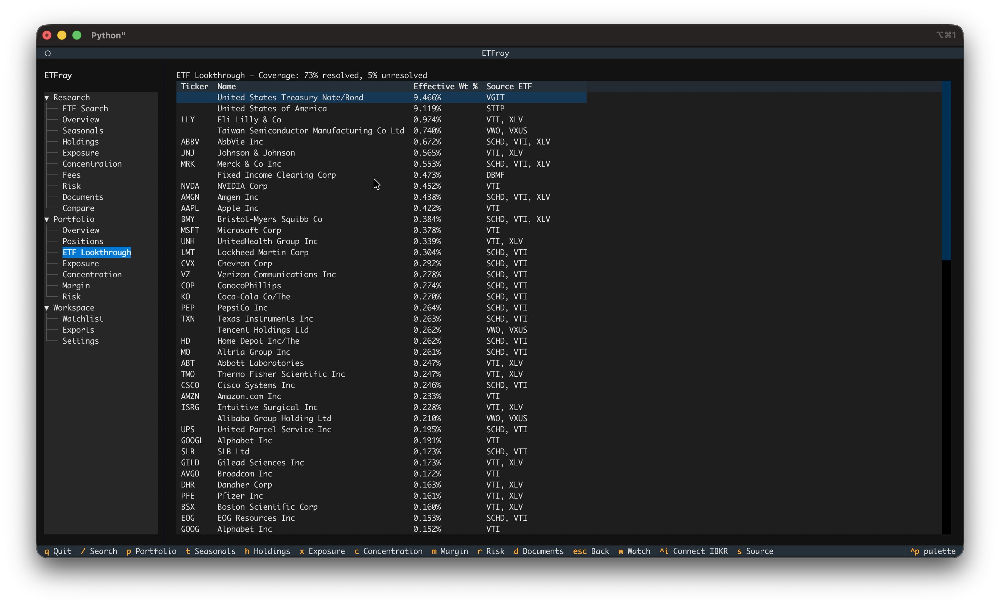
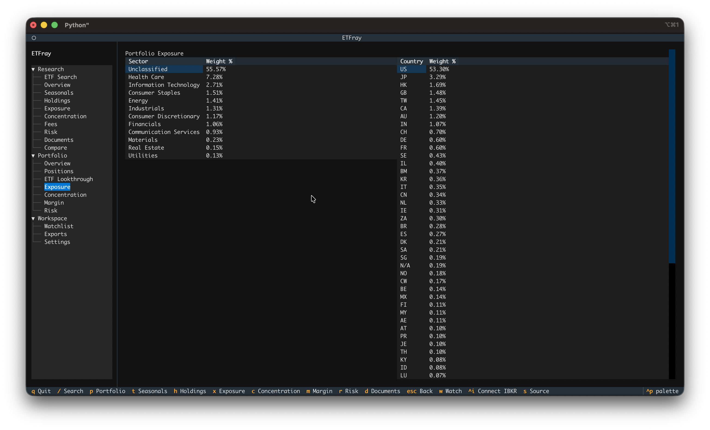
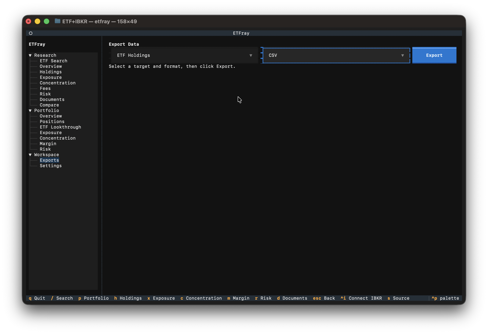

# Portfolio Analytics

The Portfolio workspace connects to your IBKR account to provide analytics across your ETF positions. It answers the question: "What do my ETFs actually make me own?"

## Requirements

- IBKR TWS or IB Gateway running with API enabled (see [IBKR Setup](ibkr-setup.md))
- At least one open position in your account

## Views

### Overview

Portfolio summary: total market value, cash, net liquidation, and position count. This is your starting point to confirm the connection is working and see your account at a glance.

### Positions

All current positions with market value, unrealized P&L, and portfolio weight. Weight is calculated as `market_value / net_liquidation × 100`.

### Lookthrough

Decomposes your ETF positions into their underlying holdings. This is the core analytical feature of the Portfolio workspace.

**The math:**

```
effective_weight = portfolio_weight_of_ETF × holding_weight_in_ETF
```

**Example:** If your portfolio is:

- VTI: 60% of portfolio
- QQQM: 40% of portfolio

And Apple (AAPL) is:

- 6.5% of VTI
- 8.8% of QQQM

Then your effective Apple exposure is:

```
(0.60 × 6.5%) + (0.40 × 8.8%) = 3.9% + 3.5% = 7.4% of your portfolio
```

This reveals that even a "diversified" two-fund portfolio can have significant single-stock concentration.

**What "Source ETF" means:** Each lookthrough holding shows which of your ETFs contribute to that exposure. If Apple appears in both VTI and QQQM, you'll see `Source ETF: VTI, QQQM`.

!!! note "Unresolved ETFs"
    If etfray can't find holdings data for one of your positions (e.g., a non-ETF stock, or an ETF without available filings), it appears in the "unresolved" list. The lookthrough still works for your other ETFs — unresolved positions are simply excluded from the decomposition.

{ width="700" }

### Exposure

Aggregated sector and geographic exposure across all portfolio ETFs, weighted by position size. Unlike the Research exposure view (which shows a single ETF), this combines all your holdings into one picture.

**What to look for:**

- Unintended sector bets — Holding VTI + QQQ + SMH might give you 50%+ in Technology without realizing it
- Geographic concentration — Multiple US ETFs means your "diversified" portfolio might be 95% US equities

{ width="700" }

### Concentration

Portfolio-level concentration analysis at the underlying stock level. Shows how concentrated your combined holdings are after lookthrough decomposition.

This uses the same HHI and effective-N metrics as the Research concentration view, but applied to your actual portfolio. A portfolio with effective N of 40 behaves like holding 40 equal-weight stocks, regardless of how many ETFs you own.

**Key insight:** Owning 5 ETFs doesn't guarantee diversification. If they all hold the same mega-cap stocks, your effective concentration may be much higher than expected.

### Margin

Margin utilization, buying power, maintenance margin, and leverage ratio. This view is critical if you use margin.

**Metrics explained:**

| Metric | Formula | What it means |
|--------|---------|---------------|
| Leverage ratio | Gross position value / Net liquidation | How much exposure you have relative to equity. 1.0 = no margin, 2.0 = 2x leveraged |
| Cushion | Excess liquidity / Net liquidation | Buffer before a margin call. 0.15 = 15% buffer remaining |
| Excess liquidity | Net liquidation − Maintenance margin | Dollar amount above the margin call threshold |
| Buying power | Available funds for new positions | How much more you can buy on margin |

**Warning thresholds:**

- **Leverage warning** fires when leverage ratio exceeds the configured threshold (default: 2.0×)
- **Cushion warning** fires when cushion drops below the configured threshold (default: 15%)

!!! warning
    Margin warnings are informational — etfray does not place trades or modify your account. If you see warnings, evaluate your positions in TWS/Gateway directly.

### Risk

Portfolio risk metrics including concentration risk, single-name exposure, and leverage warnings. This combines insights from Concentration and Margin into a single risk dashboard.

**What to watch:**

- Single-name exposure above 5% (hidden concentration via multiple ETFs)
- Leverage ratio trending upward (market moves can increase leverage even without new trades)
- Low cushion combined with concentrated positions (worst-case scenario for margin calls)

{ width="700" }
