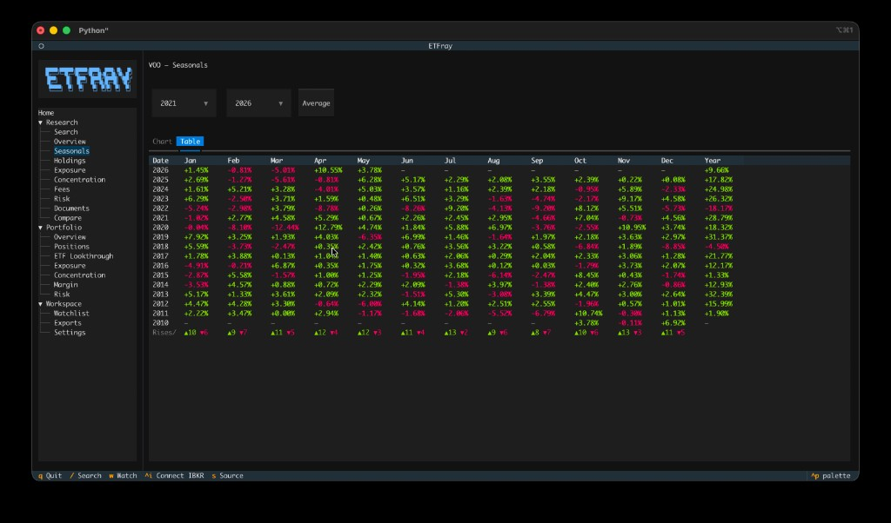

# Seasonals

The Seasonals view provides a TradingView-style seasonals chart showing year-over-year cumulative returns, alongside a period returns table for standard intervals.

**Access:** Press `t` from any research view, or navigate to **Research → Seasonals** in the sidebar.

{ width="700" }

## What It Shows

The Seasonals view has two components:

1. **Seasonals chart** — Each line represents one calendar year's cumulative return from January 1st (0% baseline). This reveals seasonal patterns: when the ETF tends to rally or pull back within a year.
2. **Period returns table** — Total returns for standard intervals (1W, 1M, 3M, 6M, YTD, 1Y, 3Y, 5Y, Max).

## Chart Modes

etfray supports two chart rendering modes:

| Mode | Requires | Quality |
|------|----------|---------|
| **matplotlib image** | `pip install etfray[charts]` + terminal image support | High-resolution PNG rendered inline |
| **plotext ASCII** | Nothing extra (included by default) | Text-based chart using Unicode block characters |

The active mode is shown in the Seasonals summary line (e.g., `Chart: image (matplotlib)` or `Chart: text (plotext)`).

### Installing chart support

```bash
pip install etfray[charts]
```

This installs `matplotlib` and `textual-image`. Verify with:

```bash
python scripts/check_charts.py
```

Expected output for full support:

```
Chart: image (matplotlib)
charts_available: True
protocol: sixel  (or tgp, iterm2)
```

### Terminal image support

For the matplotlib chart to render as a crisp image (not blocky ASCII), your terminal must support an image protocol:

| Terminal | Protocol | Setup |
|----------|----------|-------|
| iTerm2 | iterm2 | Works out of the box |
| Kitty | kitty | Works out of the box |
| WezTerm | sixel | Works out of the box |
| VS Code / Cursor | sixel | Enable `terminal.integrated.enableImages` in settings, restart terminal |
| Windows Terminal 1.22+ | sixel | Works out of the box |

Without image support, etfray falls back to plotext ASCII rendering automatically.

## Year Range Selection

Use the **Year Start** and **Year End** dropdowns to select which years to display on the chart. Each selected year gets its own colored line showing that year's cumulative return trajectory.

**Tips:**

- Select 3–5 years for a readable comparison
- Include the current year to see how this year compares to historical patterns
- The **Average** toggle shows the mean cumulative return across all selected years

## Monthly Returns Table

Switch to the **Table** tab (next to "Chart" in the tab bar) to see a full year-by-month heatmap of historical returns.

**Columns:**

| Column | Description |
|--------|-------------|
| Date | Calendar year |
| Jan–Dec | That month's total return, color-coded green (positive) or red (negative) |
| Year | Full-year calendar year return |

Each cell shows the return as `+2.34%` or `-1.20%` in bold bright green or bold bright red respectively. Future months in the current year show `—`.

**Rises/Falls footer:** The bottom row of the table shows a count for every month across all available years:

- `▲N` (green) — number of years that month closed higher
- `▼N` (red) — number of years that month closed lower

This gives you an at-a-glance win-rate for each calendar month across the full history (e.g., `▲9 ▼6` means the month closed up in 9 of 15 years).

!!! tip
    The monthly table covers **all available years** in the price history, regardless of the year range selected in the Chart tab. It is the most complete view of seasonality and is useful for spotting months that consistently perform well or poorly across decades.

{ width="700" }

## Export

Click the **Export** button in the top-right of the Seasonals view to save the seasonal data for the currently selected year range to CSV. The file is written to your configured export directory (`~/.etfray/exports/` by default) with the filename:

```
{TICKER}_seasonals_{startYear}_{endYear}.csv
```

The export contains one row per trading day per selected year, with columns for date, year, day-of-year index, and that year's cumulative return up to that day. This is useful for building custom charts or running further analysis in a spreadsheet or notebook.


The table below the chart shows total returns for standard periods:

| Period | Meaning |
|--------|---------|
| 1W | Last 7 calendar days |
| 1M | Last 1 month |
| 3M | Last 3 months |
| 6M | Last 6 months |
| YTD | Year-to-date (from January 1) |
| 1Y | Last 12 months |
| 3Y | Last 3 years |
| 5Y | Last 5 years |
| Max | Since earliest available data |

Returns are calculated from adjusted close prices (accounting for splits and dividends).

!!! note
    Period returns require sufficient price history. If the ETF has less than 5 years of data, the 5Y return will show as N/A. The `Max` period always uses all available history.

## Data Source

Price history is fetched from Yahoo Finance via yfinance and cached locally in SQLite with a 24-hour TTL. On subsequent visits, the cached data loads instantly. After 24 hours, etfray fetches fresh data automatically.

## Troubleshooting

| Problem | Cause | Solution |
|---------|-------|----------|
| "No price history" | Yahoo rate-limited or ticker not found | Wait a moment and retry; verify the ticker exists on Yahoo Finance |
| Blurry/blocky chart | Terminal lacks image protocol support | Use iTerm2, Kitty, or enable `terminal.integrated.enableImages` in VS Code/Cursor |
| `Chart: text (plotext)` | `[charts]` not installed | Run `pip install etfray[charts]` |
| `Chart: image (halfcell)` | Image protocol not detected | Check `python scripts/check_charts.py` for protocol; switch to a supported terminal |
| Missing recent year | Insufficient trading days | A year needs at least 2 trading days to appear in the chart |

## Keybinding

| Key | Action |
|-----|--------|
| `t` | Jump to Seasonals view (global) |
